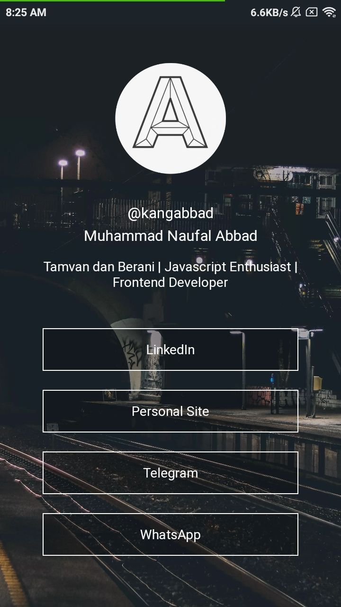

<h1 align="center">
  <br>
  <a href="https://github.com/KangAbbad/qonsen-pwa-starter" style="color: black"><span>QONSEN PWA Starter</span></a><br>
</h1>

<p align="center">
  
  
</p>

## Overview

Progressive Web Application. This project is prepared for QODR Sharing Session. The design is inspired from [Linktr.ee](https://linktr.ee/) and [ini.space](ini.space)

## Screenshot



## Installation

Make sure you have setup Create React App environment [here](https://reactjs.org/docs/create-a-new-react-app.html)

Clone this repo

```
$ git clone https://github.com/KangAbbad/qonsen-pwa-starter.git
$ cd qonsen-pwa-starter
```

Install dependencies using [yarn](https://yarnpkg.com/) or [npm](https://www.npmjs.com/)

```sh
$ yarn
```

```sh
$ npm install
```

## License

Project is published under the [MIT license](/LICENSE).